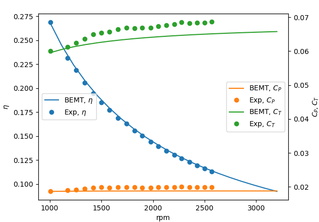

# 文件说明

- resource1: xfoil接口程序，能够求解截面翼型不同攻角气动力，并使用Viterna method外推得到180°性能曲线。
- resource2: BEMT程序，用于计算螺旋桨推力效率等。
- resource3: 遗传算法优化程序，用于优化螺旋桨的几何参数。
- resource4: 结合MS-GAN的推力优化程序。
- resource5: 结合深度预测网络的多目标优化程序，使用代理模型预测螺旋桨力学、噪声数据并进行优化。


# 第二章 三维螺旋桨气动性能与优化（*）评估
**王晨宇**

## 2.1 BEM原理

经典BEM理论的完全推导由Glauert在1935年完成，详见
Glauert, H., “Airplane propellers,” Aerodynamic theory, Springer, 1935, pp. 169–360

### 2.1.1 参数设置
来流系数包括轴向和径向。几何参数描述了旋翼和流管几何结构。性能参数表示测量旋翼性能的指标。下标0是远场，上标是气流尾迹参数。


| Flow variables  | Geometric variables   | Performance parameters   |
|-------------- | -------------- | -------------- |
|   $V_x$ 轴自由流速度  | R 转子半径     | T, $C_T$ 推力，推力系数     |
|   $u_x$ 盘上轴诱导速度 | r 径向距离  | Q,$C_Q$ 扭矩，扭矩系数|
| $u'_x$ 尾流轴向诱导速度 | $S_0$ 上游流管面积 | P,$C_P$ 动力(power)，动力系数 |
| $V_\theta$ 周向转子速度 | S 转子扫掠面积 | J 推进比|
| $u_\theta$ 盘上周向诱导速度 | $S'$ 尾流流管面积 | $\eta$ 总效率|
| $u'_\theta$ 尾流周向诱导速度 | $\theta$ 扭转角 | $\eta_1$ 轴向效率|
| W 入流速度和矢量| $\alpha$ 攻角 | $\eta_2$ 周向效率|
| $\Omega$ 周向角速度 | $\phi$ 入流角 | $\eta_3$ 轮廓(profile) 阻力效率|
| $\omega$ 周向尾流速度 | $c$ 弦长 | FM 品质因子|
| $a_x$ 轴向诱导因子 | $\sigma$ 叶片刚度 | $C_r/\sigma$ 叶片负载系数 |
|$a_\sigma$ 切向诱导系数|||


### 2.1.2 动量理论

- 分析通过转子平面气流动量的改变量。规定控制面“流管”
- 不考虑旋翼几何，只考虑动量通量

#### 2.1.2.1 轴向动量平衡

<center>


</center>

<center>


</center>

对于轴向动量，上游初始速度 $V_x$, 进入流管，转子面加速到轴向速度 $u_x$ ，最终尾流速度 $u'_x$

考虑牛顿第二定律：


$$\begin{equation} T = \dot{m_{air}}(u'_x - V_x ) =  \rho u_x S ( u'_x - V_x)   \end{equation}  $$

忽略体力，考虑质量通量在面上的积分

$$\begin{equation}T - X_p + \rho (S_0 - S' ) = \int 2 \pi \rho u_x (u'_x -V_x)r dr  \end{equation} $$

r代表径向距离，$p_0 (S_0 - S') $是作用流管两端压力， $X_p$是侧向压力。两项抵消，有

$$\begin{equation} T = \int 2 \pi \rho u_x (u'_x - V_x) r dr \end{equation}  $$

但是不可以转化为微分： $dT = 2\pi \rho u_x (u'_x  -V_x) r dr $ ,这是由于微分形式需要保证微元间无相互作用

化简未知量下游尾迹速度 $u'_x$,单位时间流管做工由公式(1) 

$$\begin{equation} P = \frac{1}{2} \dot{m_{air} }  (u'_x -V^2_x) = \frac{1}{2} \dot{m_{air}}(u'x+V_x) = \frac{1}{2}(u'_x + V_x)T \end{equation}$$

忽略了旋转诱导的滑流移动

单位时刻做的有用功即4功率

$$\begin{equation}  \dot{W_T} = T u_x \end{equation} $$

假设转子面轴向速度为远场上游与尾流速度平均

$$ \begin{equation} u_x = \frac{1}{2 }(u'_x +V_x) \end{equation}$$

或者通常用的归一化诱导因子 $a_x$

$$\begin{equation} u_x = V_x (1 + a_x) \end{equation}$$

由上述两式，有转化

$$\begin{equation}  dT = 4 \pi \rho u_x (u_x - V_x) r dr\end{equation} $$
或

$$\begin{equation}  dT = 4 \pi \rho V^2_x (1 +a_x) a_x r dr \end{equation}$$

但是公式(9)不可以在0表示来流速度，此时 $a_x$ 无定义

定义效率
$$ \begin{equation} \eta = \frac{P_{out}}{P_{in}} \end{equation}$$

输出功率是远场流动速度乘推力（无旋转动力损失情况）。考虑轴向损失下，有

$$\begin{equation} \eta_1 = \frac{V_x T}{P} = \frac{V_x}{u_x}\end{equation}$$


#### 2.1.2.2 转向动量理论

- 考虑螺旋桨滑流旋转损失（之前忽略）。由于桨叶与空气分子相互作用，增加了转向动量。
- 点质量假设，有角动量 $L = u_\theta m r^2$ 也可以写为 $ L = \omega_\theta m r^2 $

由角动量守恒，导出切向诱导速度与最终尾流速度

$$\begin{equation}  u_\theta r^2 = u'_\theta r'^2 \end{equation}$$

$$ \begin{equation} dQ = \dot{m} \omega_\theta r^2 = 2 \pi \rho \omega_\theta u_x r^3 dr = 2 \pi \rho u_\theta u_x r^2 dr\end{equation} $$

而扭矩是由角动量单位时间增长导致的

$$\begin{equation} dQ = \dot{m} u_\theta r^2 = 2 \pi \rho u_x u_\theta r^2 dr\end{equation} $$

定义切向诱导系数 $a_\theta = \frac{u_\theta}{2 V_\theta} $, 公式(14)改写为

$$ \begin{equation}dQ = 4 \pi \rho V_x V_\theta (1+a_x) a_\theta r^2 dr \end{equation}$$

在转子面前后用不可压缩无黏伯努利方程，通过转子平面的压强变化为

$$\begin{equation}\delta p = \rho \frac{1}{2}(V_\theta + (V_\theta - u_\theta))(V_\theta - (V_\theta - u_\theta))  = \rho (V_\theta - \frac{1}{2} u_\theta)u_\theta \end{equation}$$

进一步在周向面元上由无黏不可压缩假定，有

$$\begin{equation}dT^* = 2 \pi \delta p dr = 2 \pi \rho (V_\theta -  \frac{1}{2} u_\theta)u_\theta r dr  = 2 \pi \rho (\Omega r -\frac{1}{2} \omega_\theta r) \omega_\theta r^2 dr\end{equation} $$

对单位时间扭矩做功（输入），单位时间推力做工（输出）积分，有

$$\begin{equation} T^* = \int 2 \pi \rho (\Omega r - \frac{1}{2} \omega_\theta r )\omega_\theta r^2 dr = \frac{1}{4} 2 \pi \rho(\Omega R - \frac{1}{2} \omega_\theta R )\omega_\theta R^3  \end{equation}$$

$$ \begin{equation}Q = \int 2 \pi \rho \omega_\theta u_x r^3 dr = 2 \pi \rho \omega_\theta u_x r^3 \frac{R^4}{4} = \frac{R^4}{4} 2 \pi \rho u_x u_\theta \end{equation}$$


代入公式(17)得到
$$\begin{equation}\eta_1 \eta_2 = \frac{V_x T^*}{\Omega Q} = \frac{V_x \pi \rho (V_\theta - u_\theta)u_\theta R^2}{\Omega \pi \rho u_x u_{\theta} R^3} = \frac{V_x (V_\theta - \frac{1}{2}u_\theta)}{u_x V_\theta} \end{equation}$$

对比效率公式(11)可以得到转动诱导效率
$$\begin{equation}\eta_2 = \frac{V_\theta - \frac{1}{2}u_\theta}{V_\theta} \end{equation}$$


### 2.1.3 叶素动量理论
<center>


</center>


- 对于低保真（low-fidelity）转子模型可用，考虑转子几何形状。每个叶片是个二维薄翼
- 表现在叶素翼型上的升力阻力，依赖来流速度W，雷诺数，和攻角 $\alpha $


#### 2.1.3.1 叶素理论

每个叶素翼型上的推力扭力表示为

$$\begin{equation}dT = dL \cos \phi - dD \sin \phi\end{equation} $$

$$\begin{equation}dQ = dL \sin \phi + dD \cos \phi\end{equation}$$

升阻力系数表示为

$$\begin{equation}dL = \frac{1}{2} \rho W^2 C_l c dr\end{equation} $$

$$\begin{equation}dD = \frac{1}{2} \rho W^2 C_d c dr\end{equation} $$

W 为 $ W = \sqrt{u^2_x + (V_\theta - \frac{1}{2} u_\theta)^2 }$

轴向$u_x 看作 V_x$周向诱导速度为0。


#### 2.1.3.2 叶素动量理论

B为机翼数量，当推力(22)与扭力(23)相等时

$$\begin{equation}4 \pi \rho u_x (u_x - V_x) r dr = dT = \frac{1}{2} C_\theta \rho W^2 B c r dr \end{equation}$$

$$\begin{equation} 2 \pi \rho u_x u_\theta r^2 dr = \frac{1}{2} C_\theta \rho W^2 B c r dr\end{equation}$$

积分有

$$ \begin{equation}4 \pi \rho u_x( u_x - V_x)r = \frac{1}{2}(\cos \phi C_l - \sin \phi C_d)(u^2_x + (V_\theta - \frac{1}{2} u_\theta)^2)BC \end{equation}$$

$$\begin{equation} 2 \pi \rho u_x u_\theta r = \frac{1}{2} (\sin \phi C_l + \cos \phi C_d)(u^2_x + (V_\theta - \frac{1}{2})^2)BC)\end{equation} $$
定义刚度 $ \sigma = \frac{Bc}{2 \pi r}$，对于整个旋翼 $\sigma_r = \frac{B \int ^ R_0 c(r)dr }{\pi R^2} $ 化简有
$$\begin{equation} 2 u_x (u_x - V_x) = \frac{1}{2}(\cos \phi C_l - \sin \phi C_d)(u^2_x + (V_\theta - \frac{1}{2} u_\theta)^2)\sigma\end{equation} $$
$$\begin{equation}u_x u_\theta = \frac{1}{2} (\sin \phi C_l + \cos \phi C_d)(u^2_x + (V_\theta - \frac{1}{2})^2) \sigma\end{equation} $$

由公式(30)(31)得到速度分量

$$\begin{equation}u_\theta = \frac{2 \sigma C_\theta V_\theta}{4 \sin \phi \cos \phi + \sigma C_\theta} \end{equation} $$

$$\begin{equation} u_x = V_x + \frac{\sigma C_x V_\theta}{4 \sin \phi \cos \phi + \sigma C_\theta} \end{equation}  $$

将无量纲数 $a_x 和 a_\theta $ 代入公式(33)(34)

$$ \begin{equation}a_x = \frac{C_x \sigma}{4 \sin^2 \phi - C_x \sigma} \end{equation} $$
$$ \begin{equation}a_\theta = \frac{C_\theta \sigma}{2 \sin 2 \phi + C_\theta \sigma}\end{equation}   $$

引入入流角$\theta$

$$ \begin{equation}tan \phi = \frac{u_x}{V_\theta - \frac{1}{2 }u_\theta} \end{equation} $$

公式(32)(33)代入(36),已知推进比J定义为 $ J = \frac{V_\infty}{n D_p} = \frac{\pi V_x}{\pi n R} = \pi \frac{V_x}{V_\theta} $

得到

$$ \begin{equation} tan \phi = \frac{V_x + \frac{\sigma C_x V_\theta}{4 \sin \phi \cos \phi + \sigma C_\theta} }{V_\theta - \frac{ \sigma C_\theta V_\theta}{4 \sin \phi \cos \phi + \sigma C_\theta}} = \frac{(4 \sin \phi \cos \phi + \sigma C_\theta)V_x + \sigma C_x V_\theta}{4 \sin \phi \cos \phi V_\theta}\end{equation} $$

最终化简(37)得到残差迭代式

$$ \begin{equation} R(\phi) = \frac{J}{\pi}(\sigma C_\theta + 4 \phi \cos \phi )+ ( \sigma C_x - 4 \sin^2 \phi)\end{equation} $$

在公式(38)中，各参数均为弦长 $c$和扭转角 $\theta$ 的函数，迭代可以得到入流角 $\phi$ 值，可以通过二分法求解此式的根，Ning在

 Ning, S. A., “A simple solution method for the blade element momentum equations with guaranteed convergence,” Wind Energy, Vol. 17, No. 9, 2014, pp. 1327–1345.
Ning, A., “Using blade element momentum methods with gradient-based design optimization,” Structural and Multidisciplinary Optimization, 2021, pp. 1–24

两文中探索了收敛条件，用二分法找根时

if $ \phi = 0 , C_x = C_l , C_\theta = C_d $ and $\theta = \alpha$ ，可以化简公式(38)为

$$ \begin{equation} R(0) = \sigma C_d (\frac{J}{\pi} + \frac{C_l}{C_d}) \end{equation}$$

if $ \phi = \frac{\pi}{2} , C_x = -C_d , C_\theta = C_l $ and $\alpha = \theta - \frac{\pi}{2} $ ，化简公式(38)为

$$ \begin{equation} R(\frac{\pi}{2}) = \sigma(\frac{J}{\pi} C_l - C_d) - 4\end{equation} $$

如果两点异号，满足

$$ \begin{equation}C_l(\theta) > 0 \end{equation}$$
$$ \begin{equation}C_l(\theta - \frac{\pi}{2})<0\end{equation} $$

公式(41)在对称和正弯度翼型成立，而对于公式(42),在极少数 $\theta$ 接近 $\frac{\pi}{2}$ 情况 $\alpha$ 为较大的负值，$C_l$ 为0,公式(42)才失效，可以认为BEMT在绝大多数情况有解。

**附表**：

叶素动量理论总结

<center>


</center>

转子表现系数总结

<center>


</center>

程序计算流程

<center>


</center>

**注**：
本节流程来自Marius L.Ruh and John T.Hwang，具体推导详询 WCYaerospace@sjtu.edu.cn

Marius L.Ruh , John T.Hwang,"Robust modeling and optimal design of rotors using blade element momentum theory" AIAA,2021,pp.1-8.

进一步BEM修正推荐阅读报告

Winarto, Hadi. "BEMT algorithm for the prediction of the performance of arbitrary propellers." Melbourne: The Sir Lawrence Wackett Centre for Aerospace Design Technology, Royal Melbourne Institute of Technology,2004.

## 2.2 基于BEMT的旋翼性能评估


### 2.2.1 给定翼型输出曲线
由于使用BEM需要360°全角外推 $C_l - \alpha$ 与 $C_d - \alpha $ 数据，本小节完成了根据翼型坐标文件或naca四字翼型名称快速生成外推性能曲线的功能，配置环境与所需程序见`resource1`文件夹，操作语句默认在此文件夹路径下进行。


### 2.2.1.1 基础用法

**使用方法**：

如果输入naca翼型
`python extrapolate --foil 'naca4412' --Re 1e5 --base_angle '-10 10'  --save_file 'example_extrapolate'`

如果输入翼型文件
`python extrapolate --foil 'example_extrapolate/ara_d_20.dat'  --Re 1e5 --base_angle '-10 10' --save_file 'example_extrapolate'`

翼型文件格式参照`example_extrapolate/ara_d_20.dat`

**参数说明**：

|输入参数| 说明|
|----|----|
|foil|输入为naca翼型或翼型坐标文件|
|Re| 输入计算的雷诺数 |
|base_angle|输入xfoil的基础计算范围，对应 [-base_angle[0],base_angle[1]]，注意此值在合理范围内才会有结果|
|save_file| 保存的文件夹 |

再次提醒，base_angle非常重要，尤其是大雷诺数时，需要谨慎选择。

**输出结果**

输出结果可以在文件夹`save_file`查看（上例为example_extrapolate中），输出文件有两个，文件名格式为 `xfoil_Re...`和`extrapolate_Re...` 后缀名为雷诺数与翼型名称，靠下划线“_”分割。

xfoil_Re
第一行为 `Re,alpha,cl,cd,cm`下方按表格形式排列，可以用`deal_extrapolate.py` 中的`extract_matrix`读取

extrapolate_Re 
前十四行为说明文档，说明了外推后的曲线属性，详情见每行的文件说明。
外推后范围为-180°-180°，每隔1°输出一次。
xfoil计算原理详情见第一章，下面介绍外推原理。

### 2.2.1.2 外推原理

使用Viterna method外推，这种方法是外推翼型数据的最著名方法，在

Mahmuddin, Faisal, et al. "Airfoil lift and drag extrapolation with viterna and montgomerie methods." Energy Procedia 105 (2017): 811-816.

中有详细介绍。
首先使用实验或数值计算生成较小攻角的升阻力系数，使用下列公式生成失速角并外推数据

$$ \begin{equation}C_L = A_1 \sin 2 \alpha + A_2 \frac{\cos^2 \alpha}{\sin \alpha} \end{equation}$$
$$\begin{equation}C_D = B_1 \sin^\alpha + B_2 \cos \alpha \end{equation}$$

其中系数
$$\begin{equation} C_{D_{max}} \backsimeq  1.11 + 0.018 AR  \end{equation}$$
$$\begin{equation} A_1 = \frac{C_{D_{max}}}{2} \end{equation}$$
$$\begin{equation} B_1 = C_{D_{max}} \end{equation}$$
$$\begin{equation} A_2 = (C_{L_{Install}}- C_{D_{max}}  \sin \alpha_{stall} \cos \alpha_{stall} )\frac{\sin \alpha_{stall} }{\cos^2 \alpha_{stall}}\end{equation}$$
$$\begin{equation}B_2 = \frac{C_{D_{stall}} - C_{D_{max}}  \sin^2 \alpha_{stall} }{\cos \alpha_{stall}}  \end{equation}$$

公式(45)中的AR系数代表纵横比(aspect ratio)，可从有限叶片长度影响平板假设的BEM应用中获得,一般情况下定位 0.75位置处的展弦比 R/c 。
在多数假设中AR的推荐值为10，使用不同的AR值对最终结果影响不大。在外推$\alpha > 90 \degree $和 $\alpha < \alpha_{min}$中,Viterna方法不考虑压力或表面摩擦力分布；然而，通过做出一些简单的假设，可以提供一个合理的估计，该估计与使用Viterna方法预测的结果一致。尽管该方法的计算结果不是真实物理的准确表示，但它可以为早期设计提供合理的估计。

使用`airfoilprep.py`完成，最小Cd定为0.013800 

外推图片近似如图


### 2.2.2 给定弦长、扭转角、外推性能文件，输出螺旋桨性能

本节以pyBEMT程序为基础，编写完成快速计算已知旋翼的螺旋桨性能程序。配置环境与所需程序见`resource2`文件夹，操作语句默认在此文件夹路径下进行。

#### 2.2.2.1 准备文件

- 旋翼各截面几何与环境说明文件，参考`prop.ini`文件
- 各截面翼型的外推力学参数库（可以从2.2.1的resource1文件中得到），参考`BEMT_program/airfoil`文件夹中的dat文件

#### 2.2.2.2 基础用法

如果翼型在`BEMT_program/airfoil`中，循环v_inf 变量，从0.1到20，得到20个值:

`python BEMT --para_file 'example_BEMT/vali1/prop.ini' --V '20 0.1 20' --save_file  'example_BEMT/result' --draw_pic False`

如果翼型在`BEMT_program/airfoil`中，循环rpm 变量，从1000到3200，得到20个值:

`python BEMT --para_file 'example_BEMT/vali2/tmotor28.ini' --rpm '20 1000.0 3200.0' --save_file 'example_BEMT/result' --draw_pic `

**输入参数格式**：

| 输入参数  | 说明   | 
|-------------- | -------------- | 
| para_file | prop说明文件所在位置 |
| V/rpm | 需要计算的参数，三个数字代表计算个数与计算的下限和上限 |
| save_file| 保存的文件路径|
| draw_pic  | 是否画图：True/False  |

**输入文件格式**：

>[case]
rpm = 5000
v_inf = 1.0
[rotor]
nblades = 2
diameter = 0.3
radius_hub = 0.0125
section = naca0012 naca0012 naca0012 naca0012 naca0012 naca0012 naca0012 naca0012 naca0012 naca0012 naca0012 naca0012 naca0012
radius = 0.03 0.04 0.05 0.06 0.07 0.08 0.09 0.1  0.11 0.12 0.13 0.14 0.15
chord  = 0.027622   0.03166421 0.03390364 0.03458931 0.03399109 0.03238396 0.03003231 0.0271742  0.02400563 0.02066482 0.01721652 0.01363621 0.00979446
pitch = 43.83725288 39.0653117  32.64704522 28.10653926 24.81339996 21.99531739 19.5775673  17.72758179 16.3399819  15.05472676 13.7582959  12.87508345 12.1134445
load_path = F:\graduate_student\T2_GANpropeller\test1\0_database\foil\result_extrapolate_1_re5e5\
[fluid]
rho=1.225
mu=1.81e-5

- 外推文件位置需要在load_path 中输入，对应文件夹需要包含所有section中需要的外推文件。

**结果输出**：
- 在`save_file`参数对应文件夹内，会有`csv`文件保存，文件名为对应运行时间
  - 第一行为输入V或者rpm的列表
  - 下三行分别为CP,CT,eta对应工况下的值
- 可以使用excel画图或者-draw_pic 参数作图结果如下


### 2.2.3 算例验证

#### 2.2.3.1 算例一
```bash
cd example_BEMT/vali1
python run_prop.py
```
结果：


实验数据来自Definition of a benchmark for low Reynolds number propeller aeroacoustics。
Casalino, Damiano, et al. "Definition of a benchmark for low Reynolds number propeller aeroacoustics." Aerospace Science and Technology 113 (2021): 106707.

| 基础螺旋桨  | 截面翼型   | 转子直径   | 实验范围| 轴半径 |
|-------------- | -------------- | -------------- |----|----|
| APC-96    | NACA4412    | 0.3m     | J-0~0.8| 1.25cm|

螺旋桨几何


extract geometry：
<!-- ```python
chord:
[[0.992716247547708,0.0675299444931347],
[0.971311753165686,0.0774685947998831],
[0.926464241127163,0.0935597429155711],
[0.887732298912074,0.107284545720129],
[0.840846263599073,0.123848962898043],
[0.792940966648832,0.139940111013731],
[0.754209024433744,0.152245106631610],
[0.704265204209025,0.169282792871750],
[0.658398430533262,0.184900671925212],
[0.613550918494739,0.197205667543091],
[0.551375958623150,0.211403739409874],
[0.482066167290886,0.224182004089980],
[0.441295701801320,0.228914694712241],
[0.344465846263599,0.227968156587789],
[0.249674514000357,0.205251241600935],
[0.189538077403246,0.178748174116272]]
twist：
[[0.188525000000000,0.267420715740471],
[0.998830357142857,0.110935408786733],
[0.974337500000000,0.112349432644748],
[0.925351785714286,0.114706139074775],
[0.877386607142857,0.118476869362816],
[0.822277678571429,0.122718940936864],
[0.725326785714286,0.131674425370963],
[0.757983928571429,0.129317718940937],
[0.633478571428571,0.143929298807099],
[0.670217857142857,0.138744544661042],
[0.576328571428572,0.151470759383183],
[0.516116964285714,0.162311608961303],
[0.436515178571429,0.182107942973523],
[0.381406250000000,0.195776840267675],
[0.295681250000000,0.230184754146058],
[0.326297321428571,0.216515856851906],
[0.264044642857143,0.246210357870236],
[0.225264285714286,0.264121326738435],
[0.209956250000000,0.269306080884492]]

Thrust:
[[0.798682970474202,-0.151205673758865],
[0.600780196838652,3.08690307328605],
[0.475244855353415,4.63905437352246],
[0.361524604831494,5.76302600472813],
[0.244850581568745,6.51234042553191],
[0.113407694601849,7.47574468085106],
[0.00116433045034303,8.03773049645390]]
Torque:
[[0.800753951685058,0.0234329317269076],
[0.598420518938264,0.117993574297189],
[0.480269609305100,0.148907630522088],
[0.400517745302714,0.159818473895582],
[0.360641813301521,0.163000803212851],
[0.239537130927528,0.166637751004016],
[0.115478675812705,0.165728514056225],
[-0.00267223382045904,0.156636144578313]]

``` -->

**验证结果**：

**误差值**：
| | CP   | CT   | eta |
|-------------- | -------------- | -------------- |---|
| MSE | 0.0859    | 0.1373    |   0.0439   |
|max relative err| 0.28|0.23| 0.015 |

#### 2.2.3.2 算例二
```bash
cd example_BEMT/vali2
python run_tmotor.py
```
结果：

实验数据来自水下涡轮实验
Bahaj A.S., et al. “Power and thrust measurements of marine current turbines under various hydrodynamic flow conditions in a cavitation tunnel and a towing tank.” Renewable Energy 32.3 (2007): 407-426.


## 2.3 基于遗传算法的螺旋桨优化设计

本节介绍了根据python程序实现遗传算法NSGA-II自动优化旋翼的计算程序，配置环境与所需程序见`resource3`文件夹，操作语句默认在此文件夹路径下进行。

### 2.3.1 遗传算法原理
遗传算法（Genetic Algorithm, GA）起源于对生物系统所进行的计算机模拟研究。它是模仿自然界生物进化机制发展起来的随机全局搜索和优化方法，借鉴了达尔文的进化论和孟德尔的遗传学说。其本质是一种高效、并行、全局搜索的方法，能在搜索过程中自动获取和积累有关搜索空间的知识，并自适应地控制搜索过程以求得最佳解。

#### 2.3.1.1 相关概念

| 概念名称  | 概念含义   |    
|-------------- | -------------- |
| 基因型(genotype)    | 性状染色体的内部表现     | 
|表现型(phenotype)| 染色体决定的性状的外部表现，或者说，根据基因型形成的个体的外部表现|
|进化(evolution)|种群逐渐适应生存环境，品质不断得到改良。生物的进化是以种群的形式进行|
|适应度(fitness)|度量某个物种对于生存环境的适应程度|
|选择(selection)|以一定的概率从种群中选择若干个个体。一般，选择过程是一种基于适应度的优胜劣汰的过程|
|复制(reproduction)|细胞分裂时，遗传物质DNA通过复制而转移到新产生的细胞中，新细胞就继承了旧细胞的基因|
|交叉(crossover)|两个染色体的某一相同位置处DNA被切断，前后两串分别交叉组合形成两个新的染色体。也称基因重组或杂交|
|变异(mutation)|复制时可能（很小的概率）产生某些复制差错，变异产生新的染色体，表现出新的性状|
|编码(coding)|DNA中遗传信息在一个长链上按一定的模式排列。遗传编码可看作从表现型到基因型的映射|
|解码(decoding)|基因型到表现型的映射|
|个体（individual）|指染色体带有特征的实体|
|种群（population）|个体的集合，该集合内个体数称为种群的大小|

#### 2.3.1.2 遗传算法的步骤

以生物学步骤为蓝本，诠释为如下过程
1. 评估每条染色体对应个体表现型的适应度
2. 遵循适应度越高，选择概率越大的原则，从种群中选择两个个体作为父方与母方
3. 抽取父母双方的染色体，进行交叉产生子代
4. 对子代的染色体进行变异
5. 重复2、3、4过程，直到新种群产生


以算法形式表现进化过程

| 生物进化  | 遗传算法   |
|-------------- | -------------- | 
| 个体    | 问题的一个解     | 
| 个体的竞争力| 适应函数 |
|适者生存|适应值最大的值被保留概率最大|
|染色体|解的编码|
|基因|编码元素|
|群体|被选定的一组解|
|种群|根据适应函数选择的一组解|
|交叉|以一定方式由双亲产生后代的过程|
|变异|编码的某些分量产生变化的过程|

具体例子可以自主查询著名的组合优化问题「背包问题」。

数学公式（待补充）

#### 2.3.1.2 非支配排序遗传算法（NSGA-Ⅱ）

略（待补充）


### 2.3.1 设计参数（给定截面数目、截面弦长、截面扭转角）

根据读取BEM文件`.ini`的翼型确定截面数目以及初始翼型形状，

以旋翼prop.ini为例


以"Definition of a benchmark for low Reynolds number propeller aeroacoustics." 中旋翼为例
弦长分布:

扭转角分布

模型图
(待补充)

程序将自动转化为0-1的几何参数，作为优化参数


基因型，表现型


### 2.3.2 约束条件（几何约束、推力约束）

几何约束满足对应截面位置几何条件的最大、最小值，同时几何约束应满足生成旋翼的光滑程度

推力满足整体大于最小约束，局部区域小于最大约束

### 2.3.3 目标函数（固定推力，效率最小）

由第二节的BEMT程序计算旋翼属性。
在满足推力约束的要求下，效率最小为最优，

若推力不满足约束，应当推力最大为最优。

在局部区域的推力最大值应当为最优先（涉及材料属性）

对应位置的几何约束条件为最优先（涉及装配与材料问题）

### 2.3.4 基础用法

给予一个基础BEMT计算旋翼文件设置基本工况与基础旋翼几何，给定设计目标与约束目标（力与几何约束）文件，程序自动基于该翼型优化出符合条件的旋翼。

设置一个优化约束文件，给定约束文件,以适应不同需求


`python OPTIMIZE --BEM_file 'example_OPTIMIZE/prop.ini' --restrict 'example_OPTIMIZE/restrict.ini' --save_file  'example_OPTIMIZE/test/' --get_stl False --pic 'example_OPTIMIZE/test/OPTIMIZE_fig/'`


BEM计算文件参考 `example_OPTIMIZE/prop.ini` 上一节有所说明

控制文件参考 `example_OPTIMIZE/restrict1.ini `

翼型文件格式参照`example_extrapolate/ara_d_20.dat`

**参数说明**：

|输入参数| 说明|
|----|----|
|BEM_file|输入为naca翼型或翼型坐标文件|
|restrict| 输入计算的雷诺数 |
|save_file|输出的优化base和优化过程变化的图片(用处较小）|
|get_stl| 是否生成stl模型 |
| pic| 输出的结果路径（最终结果）|


**控制文件参数说明**：
见参考文件后注释


**模块**：
- NSGA2算法优化
- 目标优化 eta(max)or FM
- 曲线光滑 
- 整体约束 min_T
- 局部约束 local_cl,local_pitch,local_cR
<!-- 需要最接近局部约束 -->

约束目标eta最小，满足推力约束

分段多项式拟合？最高点位置 (7)

翼尖固定！


### 2.3.5 测试与验证

<!-- find /home/sh/WCY/auto_propeller -type f -size -10M -exec cp --parents {} /home/sh/WCY/BEM_Surrogate_Propeller \; -->